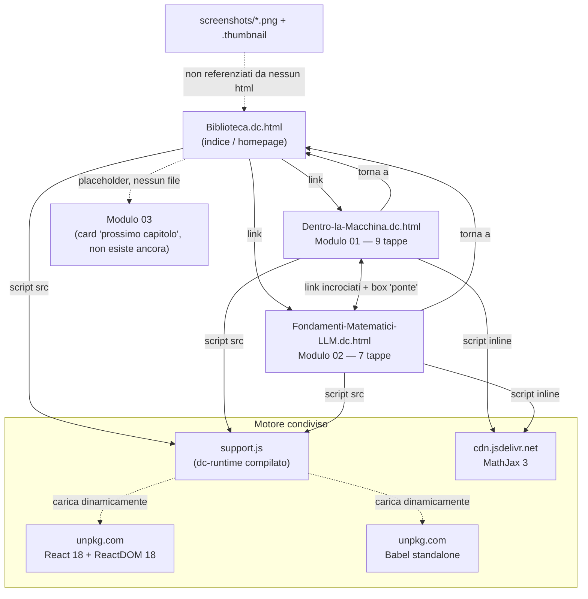

# OVERVIEW — ProgettoSTUDIO

## Cos'è

Una piccola **biblioteca di studio interattiva** in italiano su come funzionano i modelli linguistici (LLM), pensata per crescere nel tempo un "modulo" alla volta. Non è un'app con backend: è un set di file `.html` autonomi ("libri illustrati") che si aprono direttamente nel browser, ciascuno con testo, formule matematiche renderizzate e piccole demo interattive (slider, contatori, simulazioni) scritte in React.

Il formato dei file (`.dc.html`, tag `<x-dc>`, componenti `class Component extends DCLogic`) non è HTML standard: è prodotto da un runtime proprietario chiamato **dc-runtime**, il cui codice compilato è l'unico file JavaScript del progetto (`support.js`). Il codice sorgente TypeScript di quel runtime **non è presente** in questa cartella — qui c'è solo l'artefatto già compilato, usato come libreria condivisa dai tre "libri".

## Struttura e connessioni

## I file

| File | Ruolo |
|---|---|
| `Biblioteca.dc.html` | Homepage/indice. Presenta i moduli come "scaffale", con card per Modulo 01 e 02 e una card tratteggiata "Modulo 03 · Prossimo capitolo…" (fine-tuning, RAG, agenti, valutazione) come promemoria di roadmap, non un vero contenuto. |
| `Dentro-la-Macchina.dc.html` | **Modulo 01**: come un LLM genera testo passo per passo — Tokenizer, Embedding, Blocco Transformer, KV Cache, FlashAttention, LM Head, Sampling, Speculative Decoding, Detokenizer/streaming. 9 tappe, 5 demo interattive (es. tokenizzatore live, slider di temperatura con softmax ricalcolato, simulatore di speculative decoding). |
| `Fondamenti-Matematici-LLM.dc.html` | **Modulo 02**: le basi matematiche dietro il Modulo 01 — vettori, matrici, embedding come geometria, softmax, derivate/gradienti, la formula dell'attention `softmax(QKᵀ/√d)V`, e una sintesi finale. 7 tappe, con formule LaTeX vere via MathJax. |
| `support.js` | Runtime condiviso (~1840 righe, minificato/bundlato). Gestisce: parsing del tag `<x-dc>`, montaggio dei componenti React, un mini-linguaggio di espressioni/binding per il markup dichiarativo, caricamento dinamico di React/ReactDOM/Babel da CDN (con integrità SRI), gestione di import esterni (`x-import`) con trasformazione JSX via Babel in-browser. |
| `screenshots/` + `.thumbnail` | Immagini di anteprima (modalità notte, thumbnail webp) usate presumibilmente dallo strumento di authoring esterno che ha generato il progetto — **non sono linkate da nessuno dei file `.html`**. |

## Come si legge

`Biblioteca.dc.html` → consiglia di leggere prima il Modulo 01 (visione d'insieme intuitiva) e poi il Modulo 02 (fondamenta matematiche). Entrambi i moduli hanno, a metà/fine pagina, un riquadro "il ponte" che rimanda esplicitamente all'altro modulo, sottolineando che raccontano "la stessa storia a due profondità" (parole vs. formule).

## Meccanica tecnica comune ai tre file

- **Nessuna build necessaria per l'utente finale**: ogni `.dc.html` è apribile localmente col solo browser; React/ReactDOM/Babel vengono scaricati al volo da unpkg.com al primo caricamento.
- **Modalità notte**: pulsante fisso in basso a destra, stato salvato in `localStorage` (chiave `llm-book-night`), applicata con un filtro CSS `invert(1) hue-rotate(180deg)`.
- **Rendering formule**: MathJax 3 via CDN, presente solo nei due moduli (non serve in `Biblioteca.dc.html`).
- **Componenti interattivi**: ogni file definisce una `class Component extends DCLogic` con uno `state` React-like e un metodo `renderVals()` che calcola i valori derivati (token, barre di probabilità, dimensione della KV cache, ecc.) usati dal template dichiarativo.

## Correzioni e incoerenze trovate

1. **Il Modulo 02 non ha il sommario laterale fisso né la barra di avanzamento lettura che ha il Modulo 01.** `Dentro-la-Macchina.dc.html` usa un layout a due colonne con `<aside id="sidetoc">` (indice sempre visibile durante lo scroll) più `
` (barra di progresso in alto). `Fondamenti-Matematici-LLM.dc.html` non ha né l'uno né l'altro: solo un elenco puntato statico in cima alla pagina. La Biblioteca dichiara esplicitamente che "ogni modulo è un file autonomo nello stesso stile" — qui lo stile non è allineato. È la correzione più concreta e visibile da fare.
2. **Script della modalità notte duplicato tre volte identico** (in `Biblioteca.dc.html`, `Dentro-la-Macchina.dc.html`, `Fondamenti-Matematici-LLM.dc.html`) invece di vivere una sola volta dentro `support.js`. Funziona, ma ogni futura modifica (bugfix, sincronizzazione fra tab, accessibilità) va replicata a mano in tre punti — rischio concreto di divergenza nel tempo.
3. **`support.js` dichiara "GENERATED from dc-runtime/src/*.ts — do not edit. Rebuild with `cd dc-runtime && bun run build`"**, ma la cartella `dc-runtime/` con il sorgente TypeScript e la build non è presente in questo progetto. Se in futuro serve modificare il runtime (non solo i contenuti), oggi non è ricostruibile da questa cartella: bisognerebbe recuperare il sorgente dallo strumento/repo originale.
4. **Asset orfani**: le tre immagini in `screenshots/` e il file `.thumbnail` (WebP senza estensione) non sono referenziati da nessun file `.html` del progetto. Sembrano artefatti dello strumento di authoring esterno (anteprime generate automaticamente) più che contenuti del "libro": da tenere se servono a quello strumento, da rimuovere se il progetto è inteso come pacchetto autonomo da distribuire.
5. **Piccola incoerenza cosmetica nella freccia di navigazione**: nel Modulo 02, il link verso il Modulo 01 è etichettato "Modulo 01: come genera testo →" con freccia verso destra, pur essendo di fatto un "torna indietro" nell'ordine di lettura consigliato (01 → 02). Nel Modulo 01 la freccia verso il Modulo 02 è invece coerente (in avanti). Dettaglio minore, ma vale un controllo se si cura la coerenza dell'esperienza.
6. **Modulo 03 non è un bug ma un placeholder dichiarato** ("Prossimo capitolo…", fine-tuning/RAG/agenti/valutazione): nessuna azione necessaria, è già segnalato come lavoro futuro nella UI stessa.

Nessun link interno rotto: tutte le ancore `#c1…#c9` (Modulo 01) e `#c1…#c7` (Modulo 02) puntano a sezioni realmente presenti, e i tre `href` fra i file (`Biblioteca.dc.html`, `Dentro-la-Macchina.dc.html`, `Fondamenti-Matematici-LLM.dc.html`) sono coerenti con i nomi file reali. Non ci sono TODO/FIXME residui nei contenuti (gli unici match del grep erano falsi positivi: attributi CSS `placeholder` e la parola italiana "Metodo").
