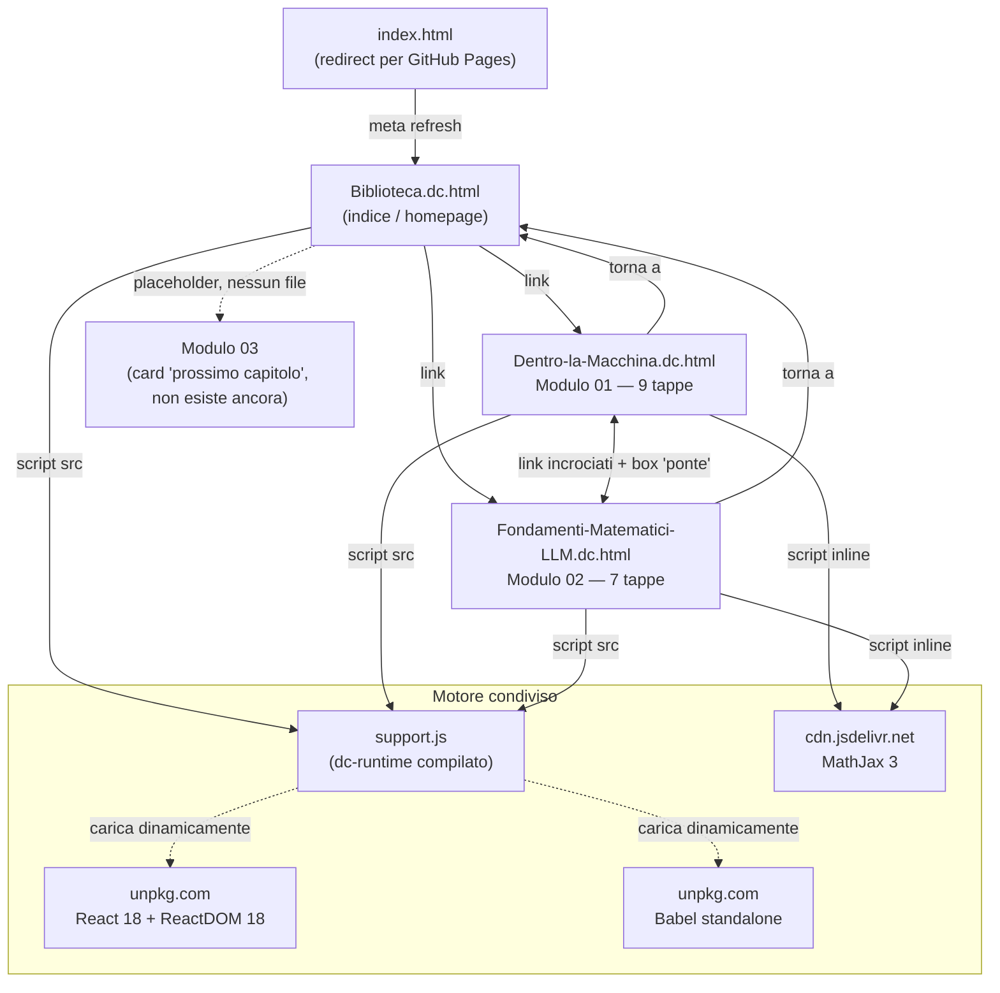

# OVERVIEW — ProgettoSTUDIO

## Cos'è

Una piccola **biblioteca di studio interattiva** in italiano su come funzionano i modelli linguistici (LLM), pensata per crescere nel tempo un "modulo" alla volta. Non è un'app con backend: è un set di file `.html` autonomi ("libri illustrati") che si aprono direttamente nel browser, ciascuno con testo, formule matematiche renderizzate e piccole demo interattive (slider, contatori, simulazioni) scritte in React.

Il formato dei file (`.dc.html`, tag `<x-dc>`, componenti `class Component extends DCLogic`) non è HTML standard: è prodotto da un runtime proprietario chiamato **dc-runtime**, il cui codice compilato è l'unico file JavaScript del progetto (`support.js`). Il codice sorgente TypeScript di quel runtime **non è presente** in questa cartella — qui c'è solo l'artefatto già compilato, usato come libreria condivisa dai tre "libri".

## Struttura e connessioni

## I file

| File | Ruolo |
|---|---|
| `Biblioteca.dc.html` | Homepage/indice. Presenta i moduli come "scaffale", con card per Modulo 01 e 02 e una card tratteggiata "Modulo 03 · Prossimo capitolo…" (fine-tuning, RAG, agenti, valutazione) come promemoria di roadmap, non un vero contenuto. |
| `Dentro-la-Macchina.dc.html` | **Modulo 01**: come un LLM genera testo passo per passo — Tokenizer, Embedding, Blocco Transformer, KV Cache, FlashAttention, LM Head, Sampling, Speculative Decoding, Detokenizer/streaming. 9 tappe, 5 demo interattive (es. tokenizzatore live, slider di temperatura con softmax ricalcolato, simulatore di speculative decoding). |
| `Fondamenti-Matematici-LLM.dc.html` | **Modulo 02**: le basi matematiche dietro il Modulo 01 — vettori, matrici, embedding come geometria, softmax, derivate/gradienti, la formula dell'attention `softmax(QKᵀ/√d)V`, e una sintesi finale. 7 tappe, con formule LaTeX vere via MathJax. |
| `wiki/wiki.css` | **Il design system.** Blocco parametri (colori, caratteri, spaziature, icone), tema chiaro e scuro, set di icone SVG incorporate, tutte le classi `w-` usate dalle pagine. È il file da cui si cambia l'aspetto dell'intera wiki. |
| `wiki/wiki.js` | **I comportamenti condivisi**, uno per tutte le pagine: tema chiaro/scuro, indice laterale generato dalle sezioni, barra di progresso, comparse allo scroll, card della homepage, configurazione MathJax. |
| `wiki/wiki-index.js` | **Il manifest** e una delle due fonti del grafo: scaffali e moduli, ciascuno con i campi di grafo `nodo` / `concetti` / `collegamenti`. La Biblioteca costruisce le card da qui, e il cervello 3D vi legge cosa è "acceso". |
| `wiki/graph/skeleton.js` | **Lo scheletro del sapere**: 282 nodi (4 domini → 26 campi → 252 sottocampi) derivati dalla gerarchia Topics di OpenAlex (CC0). È lo strato "sempre visibile ma per lo più spento" del cervello. |
| `wiki/graph/graph-model.js` | Fonde scheletro e moduli in `{ nodes, links }`. Logica pura (niente three.js, niente DOM): gira nel browser **e** in Node per la validazione. |
| `wiki/graph/explorer.js` | **Il cervello 3D** della homepage: grafo navigabile su `3d-force-graph` (via CDN). Si espande ramo per ramo, i nodi accesi aprono la pagina. Potenziamento progressivo: senza WebGL restano le card. |
| `wiki/graph/valida.js` | Controllo di coerenza del grafo da riga di comando: `node wiki/graph/valida.js`. |
| `INGEST.md` | La pipeline in sei passi per creare una pagina nuova, dall'idea/fonti fino all'aggancio al grafo. |
| `.claude/skills/biblioteca-ingest/` | La skill di Claude Code che esegue la pipeline di `INGEST.md`. |
| `_TEMPLATE.dc.html` | Scheletro da copiare per ogni pagina nuova. |
| `AGENTS.md` | Il punto d'ingresso per qualsiasi assistente o modello linguistico: la regola d'oro (leggere `docs/AgentFE.md` e `docs/AgentAutore.md` prima di toccare un `.dc.html`), il ciclo di lavoro, i divieti. In radice perché è la convenzione che gli strumenti caricano da soli. |
| `CLAUDE.md` | Tre righe che rimandano ad `AGENTS.md`. Esiste solo perché Claude Code cerca questo nome. |
| `INDEX.md` | Indice della documentazione del progetto: sei documenti, sei domande. |
| `docs/AgentFE.md` | Lo standard **della forma**: regole, classi, icone, il file dei parametri, la procedura in tre passi. |
| `docs/AgentAutore.md` | Lo standard **del contenuto**: i sette principi didattici col perché di ognuno, il procedimento dalla richiesta al libro, la checklist di verifica. |
| `docs/decisioni/` | Le decisioni di progettazione, una per file, con i problemi che risolvevano e le alternative scartate. |
| `support.js` | Runtime condiviso (~1840 righe, minificato/bundlato). Gestisce: parsing del tag `<x-dc>`, montaggio dei componenti React, un mini-linguaggio di espressioni/binding per il markup dichiarativo, caricamento dinamico di React/ReactDOM/Babel da CDN (con integrità SRI), gestione di import esterni (`x-import`) con trasformazione JSX via Babel in-browser. |
| `README.md` | Front page pubblica della repo GitHub: cos'è, come si legge, tabella dei moduli, roadmap. Rimanda a questo `OVERVIEW.md` per la mappa tecnica di dettaglio. |
| `index.html` | Redirect (`meta refresh`) verso `Biblioteca.dc.html`. Esiste solo per dare un URL pulito su GitHub Pages: `…/ProgettoSTUDIO/` apre direttamente la Biblioteca invece di mostrare un elenco di file. |
| `.gitignore` | Esclude dal versionamento i file di sistema e di editor (`.DS_Store`, `.vscode/`, `.idea/`, file temporanei) e gli artefatti dello strumento di authoring (`.thumbnail`, `screenshots/`). |

## Come si legge

`Biblioteca.dc.html` → consiglia di leggere prima il Modulo 01 (visione d'insieme intuitiva) e poi il Modulo 02 (fondamenta matematiche). Entrambi i moduli hanno, a metà/fine pagina, un riquadro "il ponte" che rimanda esplicitamente all'altro modulo, sottolineando che raccontano "la stessa storia a due profondità" (parole vs. formule).

## Meccanica tecnica comune ai tre file

- **Nessuna build necessaria per l'utente finale**: ogni `.dc.html` è apribile localmente col solo browser; React/ReactDOM/Babel vengono scaricati al volo da unpkg.com al primo caricamento.
- **Tema chiaro/scuro**: pulsante fisso in basso a destra, stato in `localStorage` (chiave `wiki-theme`), applicato con l'attributo `data-theme` sull'`<html>` e i token CSS di `wiki/wiki.css` — **nessun filtro `invert`** (vedi correzione 2). La prima visita segue la preferenza di sistema e si sincronizza fra le schede.
- **Rendering formule**: MathJax 3 via CDN, presente solo nei due moduli (non serve in `Biblioteca.dc.html`).
- **Componenti interattivi**: ogni file definisce una `class Component extends DCLogic` con uno `state` React-like e un metodo `renderVals()` che calcola i valori derivati (token, barre di probabilità, dimensione della KV cache, ecc.) usati dal template dichiarativo.

## Il grafo del sapere e il cervello 3D

La homepage non è più solo un elenco di card: è un **cervello** — un grafo 3D di
tutto il sapere, in cui i rami che abbiamo scritto sono illuminati e gli altri
restano visibili ma spenti, pronti a riempirsi.

Il grafo ha **due sole fonti di verità**, entrambe caricate via `<script>` (mai
`fetch`, che si romperebbe aprendo da `file://`):

1. **Lo scheletro** (`wiki/graph/skeleton.js`) — la mappa universale del sapere,
   derivata da OpenAlex: dominio → campo → sottocampo. Statica, quasi tutta
   spenta.
2. **Ciò che abbiamo scritto** (`wiki/wiki-index.js`) — ogni modulo dichiara a
   quale nodo si **aggancia** (`nodo`), i suoi concetti interni (`concetti`,
   uno per tappa) e i **collegamenti** verso altri moduli (i "ponti" resi dati).

`wiki/graph/graph-model.js` le fonde in un unico grafo con gerarchia
**dominio → campo → sottocampo → modulo → concetto**, marca ogni nodo acceso o
spento (l'accensione risale dai moduli fino al dominio) e assegna il colore per
dominio. `wiki/graph/explorer.js` lo disegna in 3D con `3d-force-graph`.

**Integrazione col runtime.** Il canvas del cervello sta in un `
` fratello
di `<x-dc>`, non dentro: il runtime `dc` sostituisce **solo** `<x-dc>`
(`support.js:168`, `dc.replaceWith(hostEl)`), quindi il `
` sopravvive e
React non lo tocca. È un **potenziamento progressivo**: senza WebGL, senza la
libreria (offline) o con `prefers-reduced-motion`, il cervello non parte e
restano le card della Biblioteca — un'animazione non può mai nascondere
contenuto.

Per aggiungere una pagina e agganciarla al grafo: **[INGEST.md](INGEST.md)**.
Per controllarne la coerenza: `node wiki/graph/valida.js`.

## Pubblicazione su GitHub e versionamento

Il progetto è ora versionato con **git** e pubblicato su GitHub.

- **Repository**: <https://github.com/TizianoCarpentieri/ProgettoSTUDIO> — visibilità **pubblica**.
- **Branch principale**: `main`. Due commit iniziali: il primo con tutti i contenuti già esistenti più `README.md` e `.gitignore`, il secondo con `index.html` per le GitHub Pages.
- **Autenticazione (questo Mac)**: chiave **SSH ed25519** in `~/.ssh/id_ed25519`, con la parte pubblica registrata sull'account GitHub. Il remote `origin` punta all'URL SSH `git@github.com:TizianoCarpentieri/ProgettoSTUDIO.git`, quindi `git push` funziona senza password né token a scadenza.
- **GitHub Pages**: predisposte per servire dalla **radice del branch `main`**. Grazie al redirect di `index.html`, l'indirizzo pubblico <https://tizianocarpentieri.github.io/ProgettoSTUDIO/> apre direttamente la Biblioteca. L'attivazione va fatta una sola volta da *Settings → Pages → Source: Deploy from a branch → `main` / `(root)`*.

### Flussi tipici

| Obiettivo | Come |
|---|---|
| Aggiornare il progetto da questo Mac | `git add .` → `git commit -m "…"` → `git push` |
| Solo leggere/consultare, su qualsiasi dispositivo | Aprire l'URL di GitHub Pages — nessuna installazione, funziona anche da telefono |
| Lavorarci da un altro PC | `git clone git@github.com:TizianoCarpentieri/ProgettoSTUDIO.git` (sul nuovo PC va prima generata e registrata una sua chiave SSH) |

> Divisione dei ruoli fra i due documenti: `README.md` è la vetrina pubblica (accogliente, orientata a chi apre la repo per la prima volta); `OVERVIEW.md` — questo file — resta la mappa tecnica interna con struttura, dipendenze e note di manutenzione.

## Correzioni e incoerenze trovate

1. ~~**Il Modulo 02 non ha il sommario laterale fisso né la barra di avanzamento lettura che ha il Modulo 01.**~~ **Risolto.** Nessuno dei due moduli li scrive più a mano: `wiki/wiki.js` li genera leggendo le sezioni `.w-tappa` della pagina, quindi ogni pagina presente e futura li ottiene senza codice dedicato e le pagine non possono più divergere.
2. ~~**Script della modalità notte duplicato tre volte identico.**~~ **Risolto.** Vive una sola volta in `wiki/wiki.js`. Nell'occasione è stato anche riscritto: niente più filtro `invert`, ma un vero tema scuro a variabili CSS (vedi sotto).
3. **`support.js` dichiara "GENERATED from dc-runtime/src/*.ts — do not edit. Rebuild with `cd dc-runtime && bun run build`"**, ma la cartella `dc-runtime/` con il sorgente TypeScript e la build non è presente in questo progetto. Se in futuro serve modificare il runtime (non solo i contenuti), oggi non è ricostruibile da questa cartella: bisognerebbe recuperare il sorgente dallo strumento/repo originale.
4. ~~**Asset orfani**: le tre immagini in `screenshots/` e il file `.thumbnail` (WebP senza estensione) non sono referenziati da nessun file `.html` del progetto.~~ **Risolto.** Erano artefatti dello strumento di authoring esterno, ~136 KB mai usati: rimossi dal repository e aggiunti a `.gitignore` perché non rientrino. Restano nella storia git, recuperabili con `git show ae88f68:.thumbnail`.
5. ~~**Piccola incoerenza cosmetica nella freccia di navigazione**~~ **Risolto** con la classe `w-nav-next`, che disegna la freccia da sola.

   (testo originale) **Piccola incoerenza cosmetica nella freccia di navigazione**: nel Modulo 02, il link verso il Modulo 01 è etichettato "Modulo 01: come genera testo →" con freccia verso destra, pur essendo di fatto un "torna indietro" nell'ordine di lettura consigliato (01 → 02). Nel Modulo 01 la freccia verso il Modulo 02 è invece coerente (in avanti). Dettaglio minore, ma vale un controllo se si cura la coerenza dell'esperienza.
6. **Modulo 03 non è un bug ma un placeholder dichiarato** ("Prossimo capitolo…", fine-tuning/RAG/agenti/valutazione): nessuna azione necessaria, è già segnalato come lavoro futuro nella UI stessa.

Nessun link interno rotto: tutte le ancore `#c1…#c9` (Modulo 01) e `#c1…#c7` (Modulo 02) puntano a sezioni realmente presenti, e i tre `href` fra i file (`Biblioteca.dc.html`, `Dentro-la-Macchina.dc.html`, `Fondamenti-Matematici-LLM.dc.html`) sono coerenti con i nomi file reali. Non ci sono TODO/FIXME residui nei contenuti (gli unici match del grep erano falsi positivi: attributi CSS `placeholder` e la parola italiana "Metodo").
